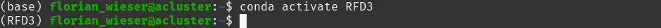

# Installation of RFdiffusion3

## Table of Contents
- [Learning Objective](#learning-objective)
- [Prerequisites](#prerequisites)
- [Tutorial](#tutorial)
    - [Step 1: Creating a conda environment](#step-1-creating-a-conda-environment)
    - [Step 2: Installing RFdiffusion3](#step-2-installing-rfdiffusion3)
    - [Step 3: Verify the installation](#step-3-verify-the-installation)
- [Glossary](#glossary)
- [Resources & References](#resources--references)

## Learning Objective
By the end of this tutorial, you will be able to install RFdiffusion3 on a Unix-based system using <code>pip</code> and verify that the installation was successful by running a minimal test example. You will also understand the difference between installing RFdiffusion3 as a released package and installing it directly from the GitHub repository, the latter enabling code modification and development workflows. 
After completing this tutorial, you will have a working RFdiffusion3 environment capable of running basic design tasks and ready for use in downstream protein design workflows.

## Prerequisites  
RFdiffusion3 is supported on Unix-based systems (Linux or macOS). Windows is not officially supported unless used through a Linux subsystem (e.g., WSL2). While not strictly required, using an environment manager such as Conda (Anaconda or Miniconda) is strongly recommended to isolate dependencies and avoid conflicts with your system-wide Python installation. For practical protein design workloads, a machine equipped with an NVIDIA GPU is highly recommended. GPU acceleration substantially reduces inference time. A recent NVIDIA driver installation is required. RFdiffusion3 can run on CPU-only systems, but runtime may increase significantly depending on the design task.

List of requirements:
- Python 3.9-3.12
- A working internet connection (for downloading the model and weights)
- Sufficient disk space for model [checkpoints](#checkpoint) (~2.7 GB)
- A downloading tool such as <code>wget</code> or </curl>
- Optional: Git (if installing from source)
- Optional but recommended: An NVIDIA GPU with a recent driver installation


## Tutorial

### Step 1: Creating a conda environment
We begin by creating an isolated [conda environment](#conda-environment). Anaconda or its lightweight variant, Miniconda, allow you to isolate Python and its associated libraries from your system-wide installation. This prevents dependency conflicts and ensures that your global Python environment remains unaffected. If any issues occur during installation, the environment can simply be removed without impacting the rest of your system.

Open a terminal shell and input the following command:  
```
conda create -n RFD3 python=3.12 -y
```

Here:
- <code>-n RFD3 </code>specifies the name of the environment.
- <code>python=3.12 </code>defines the Python version (a recent version like 3.9-3.12 is recommended).
- <code>-y </code>automatically confirms installation prompts

Once the creation is completed, activate the environment:  
```
conda activate RFD3
```

You should now see <code>(RFD3)</code> prefixed in your terminal prompt, indicating that the environment is active. 
  
To verify that the correct Python interpreter is being used, run:  
```
which python
```
The displayed path should point to the newly created [conda environment](#conda-environment), for example:  
/home/florian_wieser/miniconda3/envs/RFD3/bin/python</code>  

### Step 2: Installing RFdiffusion3
RFdiffusion 3 is distributed as part of the <code>rc-foundry</code> Python package. [Foundry](#foundry) is the RosettaCommons framework that provides a unified [command-line interface](#cli) interface for running multiple protein modeling and design deep learning models. It includes RosettaFold3 for structure prediction, ProteinMPNN for inverse folding and RFdiffusion3 for generative protein design. While this tutorial focuses on RFdiffusion3, RosettaFold3 and ProteinMPNN can be installed in a similiar manner.  

Install RFdiffusion3 using:  
```
pip install "rc-foundry[rfd3]"
```
The quotation marks around <code>rc-foundry[rfd3]</code> are important in shells such as <code>zsh</code>, where square brackets have special meaning. Without quotes, the command may fail.

#### Dowloading the model checkpoint  
RFdiffusion3 requires a trained model file (a [checkpoint](#checkpoint)) containing the learned neural network weights (~2.7 GB).  
Download the [checkpoint](#checkpoint) using:  
```
foundry install rfd3
```
By default, this command will download the [checkpoint](#checkpoint) to <code>~/.foundry/checkpoints</code>.  

Optional: If you prefer to store the [checkpoint](#checkpoint) in a custom location (for example, on a cluster with limited home directory space), you can specify a custom [checkpoint](#checkpoint) directory using the <code>--checkpoint-dir</code> flag:  
```
foundry install rfd3 --checkpoint-dir <path/to/checkpoint_dir>
```
This will download the [checkpoint](#checkpoint) to the specified directory and register that directory via the <code>FOUNDRY_CHECKPOINT_DIRS</code> [environment variable](#environment-variable), so that RFdiffusion3 automatically searches it in future runs (in addition to the default <code>~/.foundry/checkpoints</code> location).


### Step 3: Verify the installation
To verify that RFdiffusion was installed correctly, we will download and run a minimal demo example from the official RFdiffusion3 repository.  
First, create a directory for the example files (for example inside your project folder) and download the required inputs:  
```
mkdir -p input_pdbs  
wget https://raw.githubusercontent.com/RosettaCommons/foundry/production/models/rfd3/docs/demo.json  
wget -P input_pdbs https://raw.githubusercontent.com/RosettaCommons/foundry/production/models/rfd3/docs/input_pdbs/M0255_1mg5.pdb  
wget -P input_pdbs https://raw.githubusercontent.com/RosettaCommons/foundry/production/models/rfd3/docs/input_pdbs/7v11.pdb  
wget -P input_pdbs https://raw.githubusercontent.com/RosettaCommons/foundry/production/models/rfd3/docs/input_pdbs/1bna.pdb
```
After downloading the files, run the demo using:  
```
rfd3 out_dir=demo_output inputs=demo.json
```
The output directory (<code>demo_output</code>) will be created automatically if it does not exist already. On a modern GPU, this example typically completes within a few minutes. On a CPU, runtime may increase substantially depending on the hardware.  

Expected output:  
Inside <code>demo_output/</code>, you should find structure files (.cif.gz) for each demo example and summary score files (.json). If these were generated without errors, the installation was successful. You can expect the generated structures using a molecular visualization tool such as PyMOL, or examine the score files in a text editor.

## Glossary
### <a id="foundry"></a>Foundry
A toolkit from RosettaCommons that provides a unified Python [CLI](#cli) and framework for running multiple machine learning-based protein modeling and design tools (e.g., RFdiffusion3, RosettaFold3, ProteinMPNN). It also manages model weights (“[checkpoints](#checkpoint)”) and common configurations.

### <a id="checkpoint"></a>Checkpoint
A binary file that contains the trained model weights of a neural network model. For RFdiffusion3, this file stores the learned parameters the model needs for inference. Without a checkpoint, the model cannot run.

### <a id="conda-environment"></a>Conda Environment
An isolated Python environment created using Conda or Miniconda. It keeps project dependencies separate from your system Python to prevent version conflicts.

### <a id="cli"></a>CLI (Command-Line Interface)
A way to interact with software by typing commands in a terminal. Foundry and RFdiffusion3 provide CLI commands like <code>foundry install rfd3</code> and <code>rfd3</code>

### <a id="environment-variable"></a>Environment Variable
A value stored in the shell session that software can read to determine paths or settings (e.g., <code>FOUNDRY_CHECKPOINT_DIRS</code>).


## Resources & References